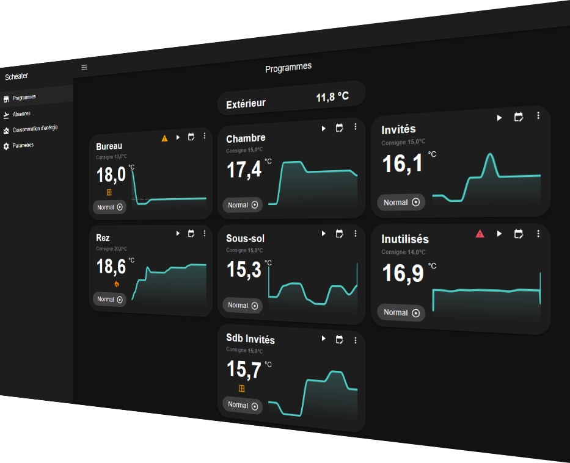



Your all-in-one assistant for controlling your electric heating.

Scheater lets you programme the temperatures of your radiators so you don’t heat your home when you don’t need to.
It features built-in control algorithms and only needs to be configured by linking your devices to Home Assistant.

It’s simple and intuitive!

## Documentation

Veuillez consulter la page officielle de [Scheater](https://scheater.io/docs).

## Premium Plan

In its free version, Scheater is limited to 5 radiators, which meets the needs of most users.
To exceed this limit and/or access all features, the Premium functions can be unlocked by purchasing a licence key.
This contribution will enable me to continue developing new features in the future.

Thank you in advance!

## Support
Found a bug? [Open an issue here](https://github.com/Ninho67/ScheaterAddOn/issues)